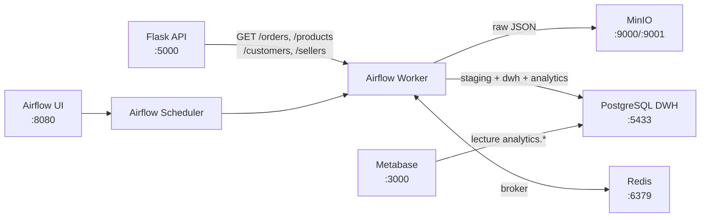
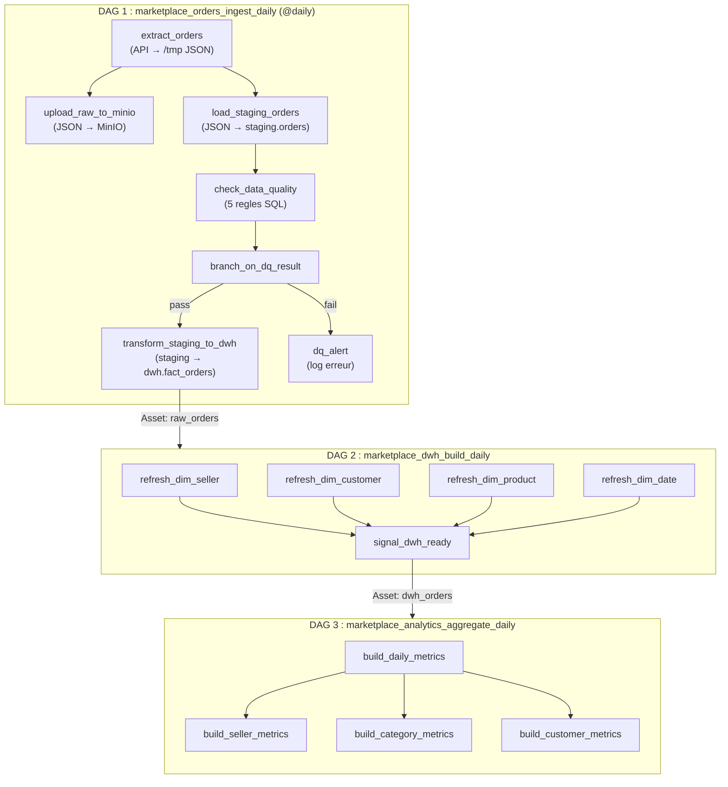

# Marketplace Analytics — IPSSI MIA 26.2 2026

## Membres

- Adrien FOUQUET
- Amaury TISSOT
- Satya MINGUEZ
- Léa DRUFFIN
- Jennifer HOUNGBEDJI

## Stack

- **Orchestration** : Apache Airflow 3.1.8 (CeleryExecutor + Redis)
- **Base de donnees** : PostgreSQL 17 (metadata Airflow + DWH + source)
- **Stockage objet** : MinIO (S3-compatible)
- **API source** : Flask 3.1 (Python 3.12)
- **Dashboards** : Metabase
- **Visualisation BDD** : pgAdmin 4

## Architecture



## DAGs livres

| DAG                                     | Role                                                                                     | Schedule                       |
| --------------------------------------- | ---------------------------------------------------------------------------------------- | ------------------------------ |
| `marketplace_orders_ingest_daily`       | Extract orders API → MinIO → staging → fact_orders (avec data quality check + branching) | `@daily`                       |
| `marketplace_dwh_build_daily`           | Refresh des dimensions (seller, customer, product, date) depuis l'API                    | Asset-triggered (`raw_orders`) |
| `marketplace_analytics_aggregate_daily` | Agregation KPIs : daily_metrics, seller_metrics, category_metrics, customer_metrics      | Asset-triggered (`dwh_orders`) |

## Workflow des DAGs

Les 3 DAGs sont chaines par des Assets Airflow. Le DAG 1 tourne chaque jour, et declenche automatiquement les DAGs suivants via des Assets.



> **Note** : si le check data quality echoue (branche `fail`), l'Asset `raw_orders` n'est pas produit et le DAG 2 ne se declenche pas. Le upload MinIO est en parallele du staging : si MinIO echoue, le reste du pipeline continue (le DAG est marque failed dans l'UI mais les donnees arrivent quand meme dans le DWH).

## Composants custom

| Composant             | Fichier                                      | Description                                                                                                                           |
| --------------------- | -------------------------------------------- | ------------------------------------------------------------------------------------------------------------------------------------- |
| `MarketplaceAPIHook`  | `plugins/hooks/marketplace_api.py`           | Hook custom (extends BaseHook) avec retry, auth Bearer, methodes `get_orders()`, `get_sellers()`, `get_products()`, `get_customers()` |
| `DataQualityOperator` | `plugins/operators/data_quality_operator.py` | Operateur de qualite de donnees configurable (regles SQL), retourne "pass"/"fail" pour branching                                      |

## Schema DWH

```
staging.orders          -- donnees brutes ingérées

dwh.dim_seller          -- PK: seller_id
dwh.dim_customer        -- PK: customer_id
dwh.dim_product         -- PK: product_id
dwh.dim_date            -- PK: dt
dwh.fact_orders         -- PK: order_id, FK vers toutes les dims

analytics.daily_metrics    -- KPIs journaliers (nb commandes, GMV, panier moyen)
analytics.seller_metrics   -- revenue + nb commandes par seller/jour
analytics.category_metrics -- revenue + nb commandes par categorie/jour
analytics.customer_metrics -- clients actifs par jour
```

## Lancement

```bash
docker compose up -d
docker compose ps

# UI Airflow : http://localhost:8080 (admin / admin)
# MinIO Console : http://localhost:9001 (minio_admin / minio_password_2026)
# Metabase : http://localhost:3000
# API : http://localhost:5000/health
# pgAdmin : http://localhost:5050
```

## Tests

pytest n'est pas installé par défaut dans le container Airflow. Il faut l'installer à la volée avant de lancer les tests :

```bash
docker compose exec airflow-worker bash -c "pip install pytest && python -m pytest tests/ -v"
```

**Tests disponibles :**

- `test_dags.py` : pas d'erreur d'import, `catchup=False` sur tous les DAGs, presence de la task idempotente `transform_staging_to_dwh`
- `test_data_quality_operator.py` : tests unitaires du DataQualityOperator (toutes regles OK, une echoue, toutes echouent, resultat None, bonne connexion utilisee)

## Choix techniques

- **CeleryExecutor + Redis** plutot que LocalExecutor : plus proche d'un setup production, permet l'execution parallele des tasks
- **MarketplaceAPIHook custom avec retry** : on a prefere ecrire notre propre hook avec `requests` + retry (3 tentatives, 2s de delai) plutot qu'utiliser le HttpHook de base pour avoir plus de controle
- **DataQualityOperator avec branching** : si les regles de qualite echouent, le DAG branche vers une alerte au lieu de planter (à l'aide d'un print dans les logs)
- **Idempotence via DELETE + INSERT** sur chaque transform : on peut rejouer n'importe quelle date sans doublon
- **Asset-triggered scheduling** entre les DAGs : le DAG analytics se declenche automatiquement quand le DAG ingest a fini, pas besoin de TriggerDagRunOperator
- **PostgreSQL 17** pour le DWH : version recente, stable, compatible avec les providers Airflow

## Difficultés rencontrées

- Il arrive que l'enregistrement des données dans le MinIo echoue, malgré nos meilleurs efforts, nous ne sommes pas parvenu à corriger ce problème.
